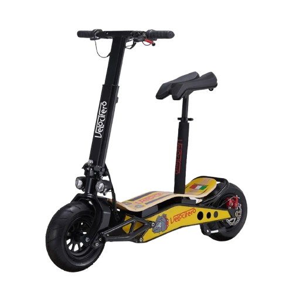
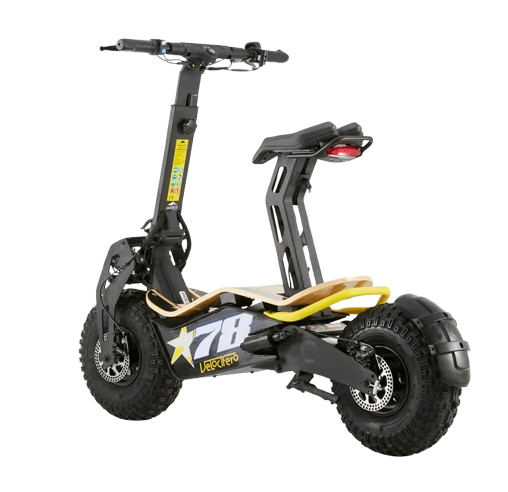
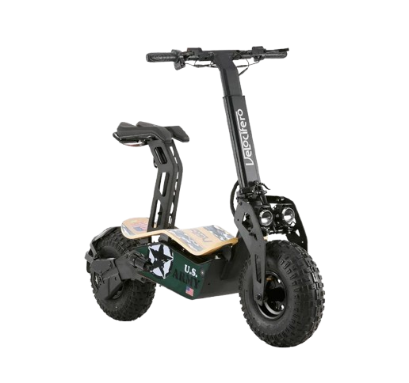

<picture>
    <source srcset="https://imgur.com/5bYAzsb.png" media="(prefers-color-scheme: dark)">
    <source srcset="https://imgur.com/Os03JoE.png" media="(prefers-color-scheme: light)">
    
</picture>

<h3>AUTOMATIZACIÓN DE PROCESOS DE MANUFACTURA</h3>

<h1>Módulo 2 - Gestion de producción</h1>

<h2>Mep Mep Raideres</h2>

<h5>Joan Sebastian Arcila  
    Juan Sebastian Daleman Martinez 
    Daniel Santiago Muñoz Bernal 
    Maria Alejandra Pérez Petro 
    Emma Carolina Sarmiento Cabarcas</h5>

<h6>Universidad Nacional de Colombia 
    Facultad de Ingeniería 
    Departamento de Ingeniería Mecánica y Mecatrónica 
    Bogotá, Colombia 
    2025</h6>

    
🗂️ Tabla de Contenido

- [Estudio de Mercado](#estudio-de-mercado)
  - [Tamaño y Crecimiento del Mercado](#tamaño-y-crecimiento-del-mercado)
  - [Estimación de volumen de producción para Mep Mep Riders](#estimación-de-volumen-de-producción-para-mep-mep-riders)
- [Productos Seleccionados](#productos-seleccionados)
- [Referencias](#referencias)

# Estudio de Mercado

El mercado de las patinetas eléctricas en Colombia ha experimentado un crecimiento notable en los últimos años, posicionándose como una alternativa clave en la movilidad sostenible. La aceptación de estos vehículos se debe principalmente a su rentabilidad en comparación con las motocicletas y su eficiencia para recorridos de distancias cortas a medias (10 a 45 kilómetros).

## Tamaño y Crecimiento del Mercado

- Volumen Anual: Se estima que el mercado colombiano de patinetas eléctricas tiene un tamaño anual aproximado de 35,000 a 40,000 unidades.
  - Según El Tiempo [2], se venden alrededor de 35,000 unidades anualmente (reporte a 2024).
  - Fenalco [1, 3] informó la venta de 18,491 patinetas eléctricas en 2022, lo que representó el 47% de su cuota de mercado en ese segmento con seis empresas afiliadas (aproximadamente 6,87% por empresa) (Fuente: Liebrenaranja). Esto sugiere un mercado total de aproximadamente 39,342 unidades solo para patinetas en 2022 (18491 / 0.47).

- Concentración Geográfica: Las ventas se concentran principalmente en grandes ciudades como Bogotá y sus municipios aledaños, Medellín, Cartagena, Cali, Pereira, Ibagué y Barranquilla, lo que indica dónde se encuentran los principales focos de demanda.

- Factores Clave de Compra: Los consumidores valoran la autonomía de la batería, la velocidad, los materiales de construcción, el peso, el sistema de suspensión y el precio. Además, factores como la distancia a recorrer, las inclinaciones del terreno y el peso del usuario son determinantes al momento de la elección.

## Estimación de volumen de producción para Mep Mep Riders
El significativo crecimiento y el tamaño considerable del mercado colombiano de patinetas eléctricas ofrecen una ventana de oportunidad favorable para nuevas empresas como Mep Mep Riders.

De acuerdo a lo investigado, se asume un volumen del mercado actual para 2025 de aproximademente 40,000 unidades anuales. 

Mep Mep Riders espera alcanzar una participación en el mercado del 10%, ligeramente superior a las empresas actuales (aproximadamente 6,87% por empresa). Para ello, en el primer año se espera una participación del 5% con un crecimiento lineal del 1% anual durante 5 años.

# Productos Seleccionados

<table border="1" style="width:100%; border-collapse: collapse; margin-bottom: 30px;">
    <thead>
        <tr>
            <th colspan="3" style="padding: 10px; text-align: center; background-color:rgb(109, 135, 146);">Patineta Eléctrica Geococcyx Lite Velox 800W [4]</th>
        </tr>
    </thead>
    <tbody>
        <tr>
            <td style="padding: 10px; text-align: center; width:33%; vertical-align: top;">
                
                 
                <em>Figura 1: Patineta eléctrica 800W</em>
            </td>
            <td style="padding: 10px; vertical-align: top; width:33%;">
                <strong>Características Técnicas:</strong>
                <ul>
                    <li><strong>Motor:</strong> 800 W Brushless (ubicado en la rueda trasera)</li>
                    <li><strong>Velocidad Máxima:</strong> Hasta 30 km/h</li>
                    <li><strong>Autonomía:</strong> Hasta 30 km por carga</li>
                    <li><strong>Batería:</strong> Litio-ion 48V/10Ah</li>
                    <li><strong>Tiempo de Carga:</strong> 4-6 horas</li>
                    <li><strong>Frenos:</strong> Disco mecánicos en ambas ruedas</li>
                    <li><strong>Capacidad de Carga:</strong> Hasta 110 kg</li>
                    <li><strong>Peso:</strong> 33 kg</li>
                    <li><strong>Dimensiones:</strong> Largo 1160 mm, Ancho 605 mm, Altura 1000 mm</li>
                    <li><strong>Precio:</strong>$3,999,000</li>
                </ul>
            </td>
            <td style="padding: 10px; vertical-align: top; width:34%;">
                <strong>Lista de Partes del Ensamble:</strong>
                <ul>
                    <li>Levas - Manilares</li>
                    <li>Dirección</li>
                    <li>Luz frontal</li>
                    <li>Soportes rueda delantera</li>
                    <li>Rueda delantera</li>
                    <li>Partes del chasis</li>
                    <li>Tabla</li>
                    <li>Soporte lateral</li>
                    <li>Sillín</li>
                    <li>Rueda trasera</li>
                    <li>Batería - Cargador</li>
                    <li>Partes eléctricas</li>
                    <li>Motor</li>
                </ul>
            </td>
        </tr>
    </tbody>
</table>

<table border="1" style="width:100%; border-collapse: collapse; margin-bottom: 30px;">
    <thead>
        <tr>
            <th colspan="3" style="padding: 10px; text-align: center; background-color:rgb(109, 135, 146);">Patineta Eléctrica Geococcyx Trial California 1600W [5] </th>
        </tr>
    </thead>
    <tbody>
        <tr>
            <td style="padding: 10px; text-align: center; width:33%; vertical-align: top;">
                
                 
                <em>Figura 2: Patineta eléctrica 1600W</em>
            </td>
            <td style="padding: 10px; vertical-align: top; width:33%;">
                <strong>Características Técnicas:</strong>
                <ul>
                    <li><strong>Motor:</strong> 1600 W Brushless</li>
                    <li><strong>Velocidad Máxima:</strong> Hasta 45 km/h</li>
                    <li><strong>Autonomía:</strong> Hasta 32 km por carga</li>
                    <li><strong>Batería:</strong> Litio-ion 48V/20Ah</li>
                    <li><strong>Tiempo de Carga:</strong> 5-8 horas</li>
                    <li><strong>Suspensión:</strong> Hidráulica delantera y trasera</li>
                    <li><strong>Frenos:</strong> Disco mecánicos en ambas ruedas</li>
                    <li><strong>Capacidad de Carga:</strong> Hasta 100 kg</li>
                    <li><strong>Peso:</strong> 60 kg</li>
                    <li><strong>Dimensiones:</strong> Largo 1320 mm, Ancho 620 mm, Altura 950 mm</li>
                    <li><strong>Precio:</strong>$7,499,000</li>
                </ul>
            </td>
            <td style="padding: 10px; vertical-align: top; width:34%;">
                <strong>Lista de Partes del Ensamble:</strong>
                <ul>
                    <li>Levas - Manilares</li>
                    <li>Dirección</li>
                    <li>Luz frontal</li>
                    <li>Soportes rueda delantera</li>
                    <li>Rueda delantera</li>
                    <li>Partes del chasis</li>
                    <li>Tabla</li>
                    <li>Soporte lateral</li>
                    <li>Sillín</li>
                    <li>Rueda trasera</li>
                    <li>Batería - Cargador</li>
                    <li>Partes eléctricas</li>
                    <li>Motor</li>
                </ul>
            </td>
        </tr>
    </tbody>
</table>

<table border="1" style="width:100%; border-collapse: collapse; margin-bottom: 30px;">
    <thead>
        <tr>
            <th colspan="3" style="padding: 10px; text-align: center; background-color:rgb(109, 135, 146);">Patineta Eléctrica Geococcyx Ultra California 2000W [6] </th>
        </tr>
    </thead>
    <tbody>
        <tr>
            <td style="padding: 10px; text-align: center; width:33%; vertical-align: top;">
                
                 
                <em>Figura 3: Patineta eléctrica 2000W</em>
            </td>
            <td style="padding: 10px; vertical-align: top; width:33%;">
                <strong>Características Técnicas:</strong>
                <ul>
                    <li><strong>Motor:</strong> 2000 W Brushless</li>
                    <li><strong>Velocidad Máxima:</strong> Hasta 45 km/h</li>
                    <li><strong>Autonomía:</strong> Hasta 40 km por carga</li>
                    <li><strong>Batería:</strong> Litio-ion 60V/20Ah</li>
                    <li><strong>Tiempo de Carga:</strong> 6-8 horas</li>
                    <li><strong>Suspensión:</strong> Hidráulica delantera y trasera</li>
                    <li><strong>Frenos:</strong> Disco mecánicos en ambas ruedas</li>
                    <li><strong>Capacidad de Carga:</strong> Hasta 120 kg</li>
                    <li><strong>Peso:</strong> 65 kg</li>
                    <li><strong>Dimensiones:</strong> Largo 1320 mm, Ancho 620 mm, Altura 950 mm</li>
                    <li><strong>Precio:</strong> $7,999,000 </li>
                </ul>
            </td>
            <td style="padding: 10px; vertical-align: top; width:34%;">
                <strong>Lista de Partes del Ensamble:</strong>
                <ul>
                    <li>Levas - Manilares</li>
                    <li>Dirección</li>
                    <li>Luz frontal</li>
                    <li>Soportes rueda delantera</li>
                    <li>Rueda delantera</li>
                    <li>Partes del chasis</li>
                    <li>Tabla</li>
                    <li>Soporte lateral</li>
                    <li>Sillín</li>
                    <li>Rueda trasera</li>
                    <li>Batería - Cargador</li>
                    <li>Partes eléctricas</li>
                    <li>Motor</li>
                </ul>
            </td>
        </tr>
    </tbody>
</table>

# Referencias

[1] “Patinetas eléctricas: El auge de la movilidad sostenible.” Liebre Naranja. [Online]. Available: https://liebrenaranja.com/patinetas-electricas-incremento-148/
  
[2] "Guía definitiva para escoger una patineta eléctrica: todo lo que debe saber". El Tiempo. [Online]. Available: https://www.eltiempo.com/tecnosfera/novedades-tecnologia/guia-definitiva-para-escoger-una-patineta-electrica-todo-lo-que-debe-saber-3400383

[3] "Retos para que la movilidad sostenible se proyecte como una verdadera línea de transición energética en el país". Fenalco. [Online]. Available: https://www.fenalco.com.co/blog/noticias-10/retos-para-que-la-movilidad-sostenible-se-proyecte-como-una-verdadera-linea-de-transicion-energetica-en-el-pais-2241

[4] “Patineta eléctrica Velocifero Mini Mad 800 - Emove | Patinetas Eléctricas.”[Online]. Available: https://www.emove.com.co/producto/patineta-electrica-velocifero-mini-mad-800/

[5] “Patineta eléctrica Velocifero Mad 1600W - Emove | Patinetas Eléctricas.” [Online]. Available: https://www.emove.com.co/producto/patineta-electrica-velocifero-mad-1600w/

[6] “Patineta eléctrica Velocifero Mad 2000W - Emove | Patinetas Eléctricas.” [Online]. Available: https://www.emove.com.co/producto/patineta-electrica-velocifero-mad-2000w/
  