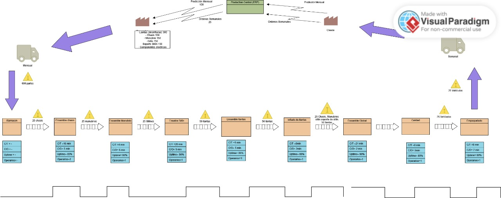
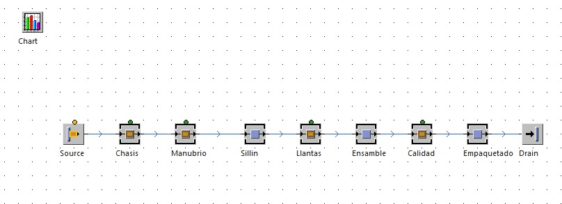
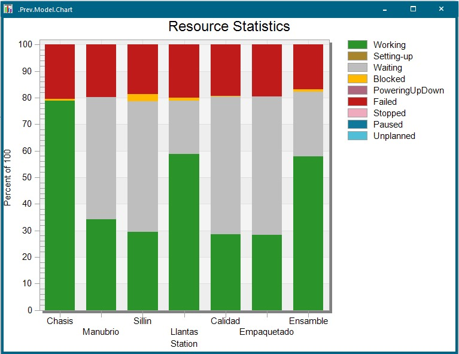
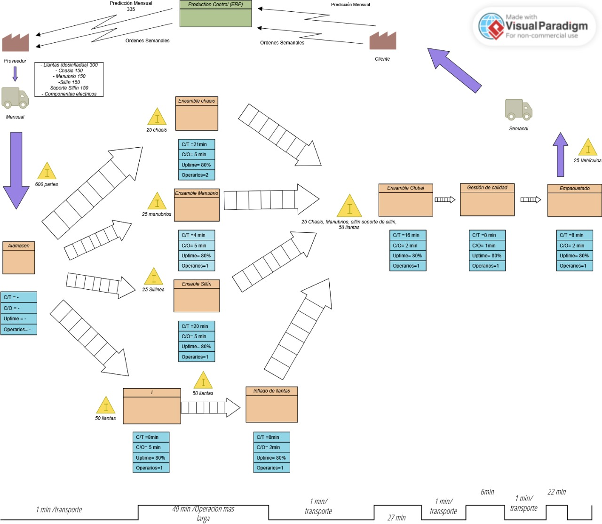
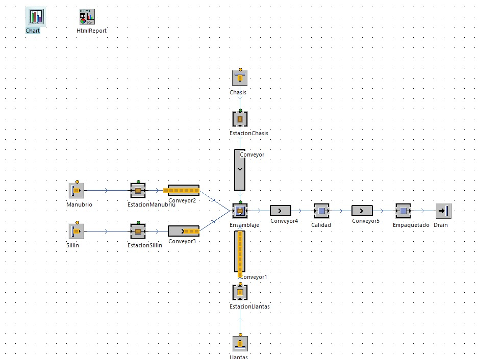
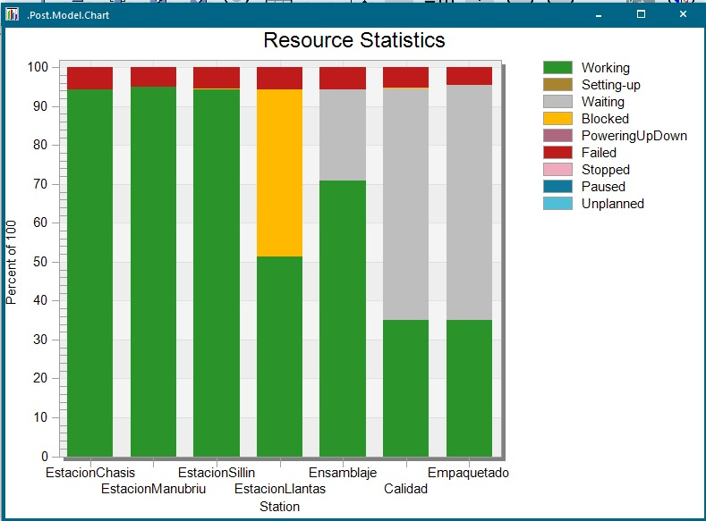

<picture>
    <source srcset="https://imgur.com/5bYAzsb.png" media="(prefers-color-scheme: dark)">
    <source srcset="https://imgur.com/Os03JoE.png" media="(prefers-color-scheme: light)">
    
</picture>

<h3>AUTOMATIZACIÓN DE PROCESOS DE MANUFACTURA</h3>

<h1>Módulo 2 - Gestion de producción</h1>

<h2>Mep Mep Raideres</h2>

<h5>Joan Sebastian Arcila  
    Juan Sebastian Daleman Martinez 
    Daniel Santiago Muñoz Bernal 
    Maria Alejandra Pérez Petro 
    Emma Carolina Sarmiento Cabarcas</h5>

<h6>Universidad Nacional de Colombia 
    Facultad de Ingeniería 
    Departamento de Ingeniería Mecánica y Mecatrónica 
    Bogotá, Colombia 
    2025</h6>

    
🗂️ Tabla de Contenido

<!-- TOC -->
- [1. 📊 Estudio de Mercado](#1--estudio-de-mercado)
  - [1.1. 📈 Tamaño y Crecimiento del Mercado](#11--tamaño-y-crecimiento-del-mercado)
  - [1.2. 🏭 Estimación de Volumen de Producción](#12--estimación-de-volumen-de-producción)
- [2. 🛵 Patientas Seleccionadass](#2--patientas-seleccionadass)
  - [3. 🛂 Antes de la Automatización](#3--antes-de-la-automatización)
    - [Principales Indicadores de Desempeño:](#principales-indicadores-de-desempeño)
  - [4. 🛂 Después de la Automatización](#4--después-de-la-automatización)
    - [Indicadores de Desempeño Mejorados:](#indicadores-de-desempeño-mejorados)
  - [🔍 5. Comparación Pre vs Post](#-5-comparación-pre-vs-post)
    - [✅ Mejoras Claras](#-mejoras-claras)
    - [⚠️ Oportunidades de Mejora](#️-oportunidades-de-mejora)
- [6. 🗃️ Referencias](#6-️-referencias)

# 1. 📊 Estudio de Mercado

El mercado de las patinetas eléctricas en Colombia ha experimentado un crecimiento notable en los últimos años, posicionándose como una alternativa clave en la movilidad sostenible. La aceptación de estos vehículos se debe principalmente a su rentabilidad en comparación con las motocicletas y su eficiencia para recorridos de distancias cortas a medias (10 a 45 kilómetros).

## 1.1. 📈 Tamaño y Crecimiento del Mercado

- Volumen Anual: Se estima que el mercado colombiano de patinetas eléctricas tiene un tamaño anual aproximado de 35,000 a 40,000 unidades.
  - Según El Tiempo [2], se venden alrededor de 35,000 unidades anualmente (reporte a 2024).
  - Fenalco [1, 3] informó la venta de 18,491 patinetas eléctricas en 2022, lo que representó el 47% de su cuota de mercado en ese segmento con seis empresas afiliadas (aproximadamente 6,87% por empresa) (Fuente: Liebrenaranja). Esto sugiere un mercado total de aproximadamente 39,342 unidades solo para patinetas en 2022 (18491 / 0.47).

- Concentración Geográfica: Las ventas se concentran principalmente en grandes ciudades como Bogotá y sus municipios aledaños, Medellín, Cartagena, Cali, Pereira, Ibagué y Barranquilla, lo que indica dónde se encuentran los principales focos de demanda.

- Factores Clave de Compra: Los consumidores valoran la autonomía de la batería, la velocidad, los materiales de construcción, el peso, el sistema de suspensión y el precio. Además, factores como la distancia a recorrer, las inclinaciones del terreno y el peso del usuario son determinantes al momento de la elección.

## 1.2. 🏭 Estimación de Volumen de Producción

Con base en la información investigada, se estima que el mercado colombiano de patinetas eléctricas para el año 2025 alcanza un volumen aproximado de 35.000 unidades anuales. Este tamaño de mercado, junto con una proyección de crecimiento sostenido, representa una oportunidad estratégica para que las empresas ensambladoras inviertan en automatización como vía para escalar su capacidad productiva.

Actualmente, una empresa promedio participa con aproximadamente 6,87% del mercado. Con la implementación del sistema de automatización propuesto por **Mep Mep Raiders**, se proyecta que **EMPRESA DE ENSAMBLAJE DE PATINETAS S.A.S.** incremente su producción de **1.400 unidades/año (4% del mercado)** a **4.020 unidades/año (9% del mercado)** en un plazo de **5 años**, con una **tasa de crecimiento anual en participación del 1%**.

**Supuestos del Modelo:**

* **Tamaño actual del mercado:** 35.000 unidades anuales
* **Crecimiento del mercado:** 5% anual
* **Crecimiento de participación de la empresa:** 1% anual
* **Distribución esperada de ventas por modelo:**

  * 500W: 50%
  * 800W: 25%
  * 2000W: 25%

> Se asume que el modelo de **500W**, por su menor costo, tendrá la mayor demanda.

---

<strong>Tabla de proyecciones de ventas anuales y mensuales por modelo</strong>

| Año | Volumen del mercado | Participación proyectada | Ventas esperadas (anual) | Ventas esperadas (mensual) | 500W (anual) | 800W (anual) | 2000W (anual) | 500W (mensual) | 800W (mensual) | 2000W (mensual) |
| --- | ------------------- | ------------------------ | ------------------------ | -------------------------- | ------------ | ------------ | ------------- | -------------- | -------------- | --------------- |
| 1   | 36.750              | 5%                       | 1.838                    | 153                        | 919          | 460          | 460           | 77             | 38             | 38              |
| 2   | 38.588              | 6%                       | 2.315                    | 193                        | 1.158        | 579          | 579           | 97             | 48             | 48              |
| 3   | 40.517              | 7%                       | 2.836                    | 236                        | 1.418        | 709          | 709           | 118            | 59             | 59              |
| 4   | 42.543              | 8%                       | 3.403                    | 284                        | 1.702        | 851          | 851           | 142            | 71             | 71              |
| 5   | 44.670              | 9%                       | 4.020                    | 335                        | 2.010        | 1.005        | 1.005         | 168            | 84             | 84              |

  

# 2. 🛵 Patientas Seleccionadass

<table border="1" style="width:100%; border-collapse: collapse; margin-bottom: 30px;">
    <thead>
        <tr>
            <th colspan="3" style="padding: 10px; text-align: center; background-color:rgb(109, 135, 146);">Patineta Eléctrica Geococcyx Lite Velox 500W [4]</th>
        </tr>
    </thead>
    <tbody>
        <tr>
            <td style="padding: 10px; text-align: center; width:33%; vertical-align: top;">
                
                 
                <em>Figura 1: Patineta eléctrica 500W</em>
            </td>
            <td style="padding: 10px; vertical-align: top; width:33%;">
                <strong>Características Técnicas:</strong>
                <ul>
                    <li><strong>Motor:</strong> 500 W Brushless</li>
                    <li><strong>Velocidad Máxima:</strong> Hasta 35 km/h</li>
                    <li><strong>Autonomía:</strong> Hasta 20-40 km por carga</li>
                    <li><strong>Batería:</strong> Litio-ion 48V/20Ah</li>
                    <li><strong>Tiempo de Carga:</strong> 4-6 horas</li>
                    <li><strong>Suspensión:</strong> Hidráulica delantera y trasera</li>
                    <li><strong>Frenos:</strong> Disco mecánicos en ambas ruedas</li>
                    <li><strong>Capacidad de Carga:</strong> Hasta 100 kg</li>
                    <li><strong>Peso:</strong> 28 kg</li>
                    <li><strong>Dimensiones:</strong> Largo 1320 mm, Ancho 620 mm, Altura 950 mm</li>
                    <li><strong>Precio:</strong>$4,199,000</li>
                </ul>
            </td>
            <td style="padding: 10px; vertical-align: top; width:34%;">
                <strong>Lista de Partes del Ensamble:</strong>
                <ul>
                    <li>Levas - Manilares</li>
                    <li>Dirección</li>
                    <li>Luz frontal</li>
                    <li>Soportes rueda delantera</li>
                    <li>Rueda delantera</li>
                    <li>Partes del chasis</li>
                    <li>Tabla</li>
                    <li>Soporte lateral</li>
                    <li>Rueda trasera</li>
                    <li>Batería - Cargador</li>
                    <li>Partes eléctricas</li>
                    <li>Motor</li>
                </ul>
            </td>
        </tr>
    </tbody>
</table>

<table border="1" style="width:100%; border-collapse: collapse; margin-bottom: 30px;">
    <thead>
        <tr>
            <th colspan="3" style="padding: 10px; text-align: center; background-color:rgb(109, 135, 146);">Patineta Eléctrica Geococcyx Trial California 800W [5]</th>
        </tr>
    </thead>
    <tbody>
        <tr>
            <td style="padding: 10px; text-align: center; width:33%; vertical-align: top;">
                
                 
                <em>Figura 2: Patineta eléctrica 800W</em>
            </td>
            <td style="padding: 10px; vertical-align: top; width:33%;">
                <strong>Características Técnicas:</strong>
                <ul>
                    <li><strong>Motor:</strong> 800 W Brushless (ubicado en la rueda trasera)</li>
                    <li><strong>Velocidad Máxima:</strong> Hasta 30 km/h</li>
                    <li><strong>Autonomía:</strong> Hasta 30 km por carga</li>
                    <li><strong>Batería:</strong> Litio-ion 48V/10Ah</li>
                    <li><strong>Tiempo de Carga:</strong> 4-6 horas</li>
                    <li><strong>Frenos:</strong> Disco mecánicos en ambas ruedas</li>
                    <li><strong>Capacidad de Carga:</strong> Hasta 110 kg</li>
                    <li><strong>Peso:</strong> 33 kg</li>
                    <li><strong>Dimensiones:</strong> Largo 1160 mm, Ancho 605 mm, Altura 1000 mm</li>
                    <li><strong>Precio:</strong>$3,999,000</li>
                </ul>
            </td>
            <td style="padding: 10px; vertical-align: top; width:34%;">
                <strong>Lista de Partes del Ensamble:</strong>
                <ul>
                    <li>Levas - Manilares</li>
                    <li>Dirección</li>
                    <li>Luz frontal</li>
                    <li>Soportes rueda delantera</li>
                    <li>Rueda delantera</li>
                    <li>Partes del chasis</li>
                    <li>Tabla</li>
                    <li>Soporte lateral</li>
                    <li>Sillín</li>
                    <li>Rueda trasera</li>
                    <li>Batería - Cargador</li>
                    <li>Partes eléctricas</li>
                    <li>Motor</li>
                </ul>
            </td>
        </tr>
    </tbody>
</table>

<table border="1" style="width:100%; border-collapse: collapse; margin-bottom: 30px;">
    <thead>
        <tr>
            <th colspan="3" style="padding: 10px; text-align: center; background-color:rgb(109, 135, 146);">Patineta Eléctrica Geococcyx Ultra California 2000W [6] </th>
        </tr>
    </thead>
    <tbody>
        <tr>
            <td style="padding: 10px; text-align: center; width:33%; vertical-align: top;">
                
                 
                <em>Figura 3: Patineta eléctrica 2000W</em>
            </td>
            <td style="padding: 10px; vertical-align: top; width:33%;">
                <strong>Características Técnicas:</strong>
                <ul>
                    <li><strong>Motor:</strong> 2000 W Brushless</li>
                    <li><strong>Velocidad Máxima:</strong> Hasta 45 km/h</li>
                    <li><strong>Autonomía:</strong> Hasta 40 km por carga</li>
                    <li><strong>Batería:</strong> Litio-ion 60V/20Ah</li>
                    <li><strong>Tiempo de Carga:</strong> 6-8 horas</li>
                    <li><strong>Suspensión:</strong> Hidráulica delantera y trasera</li>
                    <li><strong>Frenos:</strong> Disco mecánicos en ambas ruedas</li>
                    <li><strong>Capacidad de Carga:</strong> Hasta 120 kg</li>
                    <li><strong>Peso:</strong> 65 kg</li>
                    <li><strong>Dimensiones:</strong> Largo 1320 mm, Ancho 620 mm, Altura 950 mm</li>
                    <li><strong>Precio:</strong> $7,999,000 </li>
                </ul>
            </td>
            <td style="padding: 10px; vertical-align: top; width:34%;">
                <strong>Lista de Partes del Ensamble:</strong>
                <ul>
                    <li>Levas - Manilares</li>
                    <li>Dirección</li>
                    <li>Luz frontal</li>
                    <li>Soportes rueda delantera</li>
                    <li>Rueda delantera</li>
                    <li>Partes del chasis</li>
                    <li>Tabla</li>
                    <li>Soporte lateral</li>
                    <li>Sillín</li>
                    <li>Rueda trasera</li>
                    <li>Batería - Cargador</li>
                    <li>Partes eléctricas</li>
                    <li>Motor</li>
                </ul>
            </td>
        </tr>
    </tbody>
</table>

## 3. 🛂 Antes de la Automatización

Actualmente, las patinetas se ensamblan de forma secuencial en una línea de producción. Los módulos destacados del proceso son:

* Ensamble del **chasis**
* Ensamble del **manubrio**
* Ensamble del **sillín**
* Ensamble de **llantas** (que llegan despresurizadas y deben ser infladas)
* **Ensamble final**, donde se integran todos los subensambles anteriores junto con otros componentes como luces y cableado

<figure>
  
  <figcaption><b>Figura 3.1</b> – Mapa de Valor (VSM) del proceso de ensamblaje antes de la automatización.</figcaption>
</figure>

La distribución de planta antes de la automatización es la siguiente:

<figure>
  
  <figcaption><b>Figura 3.2</b> – Modelo de planta actual sin automatización.</figcaption>
</figure>

A continuación, se muestra la utilización de recursos en el escenario actual:

<figure>
  
  <figcaption><b>Figura 3.3</b> – Estadísticas de utilización de recursos antes de la automatización.</figcaption>
</figure>

### Principales Indicadores de Desempeño:

| **KPI**              | **Descripción**                                          | **Valor**           |
| -------------------- | -------------------------------------------------------- | ------------------- |
| *Takt Time*          | Tiempo necesario para cumplir la demanda (min/unidad)    | 82,05 min/patineta  |
| *Tiempo de ciclo*    | Tiempo real de producción por unidad                     | 135 min/patineta    |
| *Tasa de producción* | Unidades producidas por hora                             | 0,44 patinetas/hora |
| *Disponibilidad (A)* | Porcentaje de tiempo operativo disponible                | 80 %                |
| *Eficiencia (E)*     | Relación entre tiempo ideal y tiempo real (Takt / Ciclo) | 61 %                |
| *Calidad (Q)*        | Porcentaje de unidades sin defectos                      | 95 %                |
| **OEE**              | Efectividad total del equipo (A × E × Q)                 | 46 %                |

---

## 4. 🛂 Después de la Automatización

Se propone una solución de automatización basada en tres acciones clave:

* Automatización del **transporte interno** mediante bandas transportadoras
* Uso de un robot colaborativo en el ensamble general.
* Uso de una **celda robótica** para el inflado de llantas

Esto permite migrar de una planta secuencial a una planta **paralelizada**, mejorando el flujo y reduciendo los cuellos de botella.

<figure>
  
  <figcaption><b>Figura 4.1</b> – Mapa de Valor (VSM) del proceso de ensamblaje después de la automatización.</figcaption>
</figure>

La disposición de planta luego de la implementación se muestra a continuación:

<figure>
  
  <figcaption><b>Figura 4.2</b> – Modelo de planta automatizada con transporte y subprocesos paralelizados.</figcaption>
</figure>

El desempeño mejorado de los recursos se observa en la siguiente gráfica:

<figure>
  
  <figcaption><b>Figura 4.3</b> – Estadísticas de utilización de recursos después de la automatización.</figcaption>
</figure>

### Indicadores de Desempeño Mejorados:

| **KPI**              | **Descripción**                                          | **Valor**           |
| -------------------- | -------------------------------------------------------- | ------------------- |
| *Takt Time*          | Tiempo necesario para cumplir la demanda (min/unidad)    | 28,57 min/patineta  |
| *Tiempo de ciclo*    | Tiempo real de producción por unidad                     | 34,07 min/patineta  |
| *Tasa de producción* | Unidades producidas por hora                             | 1,76 patinetas/hora |
| *Disponibilidad (A)* | Porcentaje de tiempo operativo disponible                | 80 %                |
| *Eficiencia (E)*     | Relación entre tiempo ideal y tiempo real (Takt / Ciclo) | 84 %                |
| *Calidad (Q)*        | Porcentaje de unidades sin defectos                      | 95 %                |
| **OEE**              | Efectividad total del equipo (A × E × Q)                 | 64 %                |

---

## 🔍 5. Comparación Pre vs Post
A continuación se presenta una comparación entre las **estadísticas de utilización de recursos antes y después de la automatización** en la planta de ensamblaje de patinetas. Las gráficas 4.3 y 3.3 muestran cómo se distribuye el tiempo de cada estación entre trabajo efectivo ("Working") y tiempos improductivos (espera, bloqueos, fallas, etc.).

| Estación        | Antes de la Automatización                          | Después de la Automatización                                          |
| --------------- | --------------------------------------------------- | --------------------------------------------------------------------- |
| **Chasis**      | \~80 % trabajando, 20 % detenido/fallado            | \~95 % trabajando, mejora significativa                               |
| **Manubrio**    | \~35 % trabajando, alta proporción en "Failed"      | \~95 % trabajando, eficiencia muy alta                                |
| **Sillín**      | \~30 % trabajando, gran parte en "Failed"           | \~92 % trabajando, mejora notable                                     |
| **Llantas**     | \~65 % trabajando, con algo de "Waiting" y "Failed" | \~53 % trabajando, \~35 % esperando, indica posible cuello de botella |
| **Ensamblaje**  | \~65 % trabajando, \~35 % detenido o en falla       | \~70 % trabajando, reducción de fallas                                |
| **Calidad**     | \~30 % trabajando, \~70 % detenido o fallado        | \~35 % trabajando, mejora marginal                                    |
| **Empaquetado** | \~30 % trabajando, resto detenido o fallado         | \~35 % trabajando, mejora ligera                                      |

### ✅ Mejoras Claras

* Las estaciones de **chasis**, **manubrio** y **sillín** muestran un aumento considerable en tiempo productivo, alcanzando más del 90 % de utilización.
* Las fallas recurrentes antes de la automatización desaparecen casi por completo.

### ⚠️ Oportunidades de Mejora

* La **Estación de Llantas** después de la automatización presenta una alta proporción de tiempo en **"Waiting"** (\~35 %), lo cual sugiere que los tiempos de llegada o la secuencia de operación podrían estar generando un cuello de botella.
* Las estaciones de **calidad** y **empaquetado** aún muestran una baja utilización (\~35 % en trabajo efectivo), posiblemente porque están sobredimensionadas para la nueva cadencia de producción.

 

> En conclusión, La automatización generó un **mejor aprovechamiento general de los recursos**, especialmente en las primeras etapas del proceso (pre-ensamblaje). Sin embargo, la eficiencia del sistema completo podría seguir mejorando si se optimizan las operaciones finales de control de calidad y empaquetado, que ahora parecen estar desbalanceadas respecto al resto de la línea.

# 6. 🗃️ Referencias

[1] “Patinetas eléctricas: El auge de la movilidad sostenible.” Liebre Naranja. [Online]. Available: https://liebrenaranja.com/patinetas-electricas-incremento-148/
  
[2] "Guía definitiva para escoger una patineta eléctrica: todo lo que debe saber". El Tiempo. [Online]. Available: https://www.eltiempo.com/tecnosfera/novedades-tecnologia/guia-definitiva-para-escoger-una-patineta-electrica-todo-lo-que-debe-saber-3400383

[3] "Retos para que la movilidad sostenible se proyecte como una verdadera línea de transición energética en el país". Fenalco. [Online]. Available: https://www.fenalco.com.co/blog/noticias-10/retos-para-que-la-movilidad-sostenible-se-proyecte-como-una-verdadera-linea-de-transicion-energetica-en-el-pais-2241

[4] “Patineta eléctrica Velocifero Mini Mad  500W - Emove | Patinetas Eléctricas.” [Online]. Available: https://media.autecomobility.com/recursos/marcas/catalogos-partes-marcas-2023/patineta-electrica-velocifero-plus-500-w.pdf

[5] “Patineta eléctrica Velocifero Mini Mad 800 - Emove | Patinetas Eléctricas.”[Online]. Available: https://www.emove.com.co/producto/patineta-electrica-velocifero-mini-mad-800/

[6] “Patineta eléctrica Velocifero Mad 2000W - Emove | Patinetas Eléctricas.” [Online]. Available: https://www.emove.com.co/producto/patineta-electrica-velocifero-mad-2000w/
  
